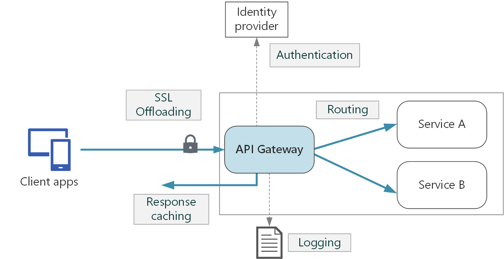
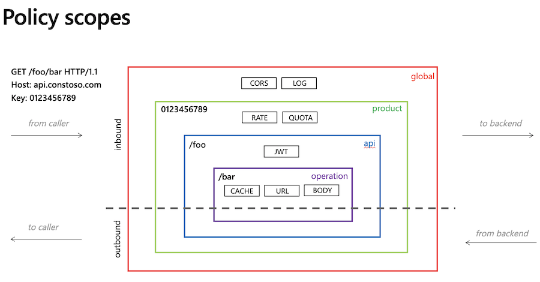
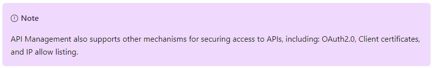

# Discover the API Management service
Each API consists of one or more operations, and each API can be added to one or more products

The system is made up of the following components:
- The **API gateway** is the endpoint that:
    - Accepts API calls and routes them to your backend(s)
    - Verifies API keys, JWT tokens, certificates, and other credentials
    - Enforces usage quotas and rate limits
    - Transforms your API on the fly without code modifications
    - Caches backend responses where set up
    - Logs call metadata for analytics purposes

- The **Azure portal** is the administrative interface where you set up your API program. Use it to:
    - Define or import API schema
    - Package APIs into products
    - Set up policies like quotas or transformations on the APIs
    - Get insights from analytics
    - Manage users

- The **Developer portal** serves as the main web presence for developers, where they can:
    - Read API documentation
    - Try out an API via the interactive console
    - Create an account and subscribe to get API keys
    - Access analytics on their own usage

## Products
Products are how APIs are surfaced to developers
- Products in API Management have one or more APIs, and are configured with a title, description, and terms of use
- Products can be Open or Protected
- Protected products must be subscribed to before they can be used, while open products can be used without a
  subscription
- Subscription approval is configured at the product level and can either require administrator approval, or be
  auto-approved

## Azure API Management Groups
Groups are used to manage the visibility of products to developers. API Management has the following immutable system
groups:
- **Administrators** - Azure subscription administrators are members of this group. Administrators manage API Management
  service instances, creating the APIs, operations, and products that are used by developers
- **Developers** - Authenticated developer portal users fall into this group. Developers are the customers that build
  applications using your APIs. Developers are granted access to the developer portal and build applications that call
  the operations of an API
- **Guests** - Unauthenticated developer portal users, such as prospective customers visiting the developer portal of an
  API Management instance fall into this group. They can be granted certain read-only access, such as the ability to
  view APIs but not call them In addition to these system groups, administrators can create custom groups or leverage
  external groups in associated Azure Active Directory tenants

## Explore API gateways


Gateways can perform a number of different functions, that can be grouped into the following design patterns:
- **Gateway routing**: Use the gateway as a reverse proxy to route requests to one or more backend services, using layer
  7 routing. The gateway provides a single endpoint for clients, and helps to decouple clients from services
- **Gateway aggregation**: Use the gateway to aggregate multiple individual requests into a single request. This pattern
  applies when a single operation requires calls to multiple backend services. The client sends one request to the
  gateway. The gateway dispatches requests to the various backend services, and then aggregates the results and sends
  them back to the client. This helps to reduce chattiness between the client and the backend
- **Gateway Offloading**: Use the gateway to offload functionality from individual services to the gateway, particularly
  cross-cutting concerns. It can be useful to consolidate these functions into one place, rather than making every
  service responsible for implementing them

Here are some examples of functionality that could be offloaded to a gateway:
- SSL termination
- Authentication
- IP allow/block list
- Client rate limiting (throttling)
- Logging and monitoring
- Response caching
- GZIP compression
- Servicing static content

## [Explore API Management policies](https://docs.microsoft.com/en-us/azure/api-management/api-management-policies)
- Policies are a powerful capability of API Management that allow the Azure portal to change the behavior of the API
  through configuration
- Policies are a collection of statements that are executed sequentially on the request or response of an API
- Popular statements include:
    - format conversion from XML to JSON
    - call rate limiting to restrict the number of incoming calls from a developer
    - filtering requests that come from certain IP addresses
- Policies are applied inside the gateway which sits between the API consumer and the managed API
- A policy can apply changes to both the inbound request and outbound response
- The policy definition is a simple XML document that describes a sequence of inbound and outbound statements
- The configuration is divided into **inbound**, **backend**, **outbound**, **and on-error**
```
<policies>
  <inbound>
    <!-- statements to be applied to the request go here -->
  </inbound>
  <backend>
    <!-- statements to be applied before the request is forwarded to 
         the backend service go here -->
  </backend>
  <outbound>
    <!-- statements to be applied to the response go here -->
  </outbound>
  <on-error>
    <!-- statements to be applied if there is an error condition go here -->
  </on-error>
</policies>
```
- If there is an error during the processing of a request, any remaining steps in the inbound, backend, or outbound
  sections are skipped and execution jumps to the statements in the on-error section



## Create advanced policies

### Control flow - Conditionally applies policy statements based on the results of the evaluation of Boolean expressions
- the `choose` policy applies enclosed policy statements based on the outcome of evaluation of boolean expressions,
  similar to an if-then-else or a switch construct in a programming language.
- can have multiple `when` elements, but a single, optional `otherwise` which applies only if all the preceding `when`
  elements evaluated to false
- it basically is an `if/else-if/else`
```
<choose>
    <when condition="Boolean expression | Boolean constant">
        <!— one or more policy statements to be applied if the above condition is true  -->
    </when>
    <when condition="Boolean expression | Boolean constant">
        <!— one or more policy statements to be applied if the above condition is true  -->
    </when>
    <otherwise>
        <!— one or more policy statements to be applied if none of the above conditions are true  -->
</otherwise>
</choose>
```

### Forward request - Forwards the request to the backend service
- The `forward-request` policy forwards the incoming request to the backend service specified in the request context
- The backend service URL is specified in the API settings and can be changed using the set backend service policy
```
<forward-request timeout="time in seconds" follow-redirects="true | false"/>
```

### Limit concurrency
- The `limit-concurrency` policy prevents enclosed policies from executing by more than the specified number of requests
  at any time
```
<limit-concurrency key="expression" max-count="number">
        <!— nested policy statements -->
</limit-concurrency>
```

### Log to Event Hub
- The `log-to-eventhub` policy sends messages in the specified format to an Event Hub defined by a Logger entity
```
<log-to-eventhub logger-id="id of the logger entity" partition-id="index of the partition where messages are sent" partition-key="value used for partition assignment">
  Expression returning a string to be logged
</log-to-eventhub>
```

### Mock response
- The `mock-response`, as the name implies, is used to mock APIs and operations
- It aborts normal pipeline execution and returns a mocked response to the caller
```
<mock-response status-code="code" content-type="media type"/>
```

### Retry
- The `retry` policy executes its child policies once and then retries their execution until the retry `condition`
  becomes `false` or retry `count` is exhausted
```
<retry
    condition="boolean expression or literal"
    count="number of retry attempts"
    interval="retry interval in seconds"
    max-interval="maximum retry interval in seconds"
    delta="retry interval delta in seconds"
    first-fast-retry="boolean expression or literal">
        <!-- One or more child policies. No restrictions -->
</retry>
```

### Return response
- The `return-response` policy aborts pipeline execution and returns either a default or custom response to the caller
- Default response is `200 OK` with `no body`
- Custom response can be specified via a context variable or policy statements
- When both are provided, the response contained within the context variable is modified by the policy statements before
  being returned to the caller
```
<return-response response-variable-name="existing context variable">
  <set-header/>
  <set-body/>
  <set-status/>
</return-response>
```

## Secure APIs by using subscriptions
- When you publish APIs through API Management, it's easy and common to secure access to those APIs by using
  subscription keys
- To get a subscription key for accessing APIs, a subscription is required
- A subscription is essentially a named container for a pair of subscription keys
  

### Subscriptions and Keys
- A subscription key is a unique auto-generated key that can be passed through in the headers of the client request or
  as a query string parameter
- The key is directly related to a subscription, which can be scoped to different areas
- Clients of the API must include a valid key in all HTTP requests
- Keys can be passed in the request header, or as a query string in the URL
- the default header name is **Ocp-Apim-Subscription-Key**, and the default query string is **subscription-key**
```
curl --header "Ocp-Apim-Subscription-Key: <key string>" https://<apim gateway>.azure-api.net/api/path
```
```
curl https://<apim gateway>.azure-api.net/api/path?subscription-key=<key string>
```

| Scope       | Details                                                                                                                                                                                                    |
|:------------|:-----------------------------------------------------------------------------------------------------------------------------------------------------------------------------------------------------------|
| All APIs    | Applies to every API accessible from the gateway                                                                                                                                                           |
| Single API  | This scope applies to a single imported API and all of its endpoints                                                                                                                                       |
| Product     | A product is a collection of one or more APIs that you configure in API Management. You can assign APIs to more than one product. Products can have different access rules, usage quotas, and terms of use |


## Secure APIs by using certificates
- Certificates can be used to provide Transport Layer Security (TLS) mutual authentication between the client and the API gateway
- You can configure the API Management gateway to allow only requests with certificates containing a specific thumbprint
- The authorization at the gateway level is handled through inbound policies
- With TLS client authentication, the API Management gateway can inspect the certificate contained within the client 
  request and check for properties like:

| Property                     | Description                                           |
|:-----------------------------|:------------------------------------------------------|
| Certificate Authority (CA)   | 	 Only allow certificates signed by a particular CA   |
| Thumbprint                   | 	Allow certificates containing a specified thumbprint |
| Subject                      | 	Only allow certificates with a specified subject     |
| Expiration Date              | Only allow certificates that have not expired         |

